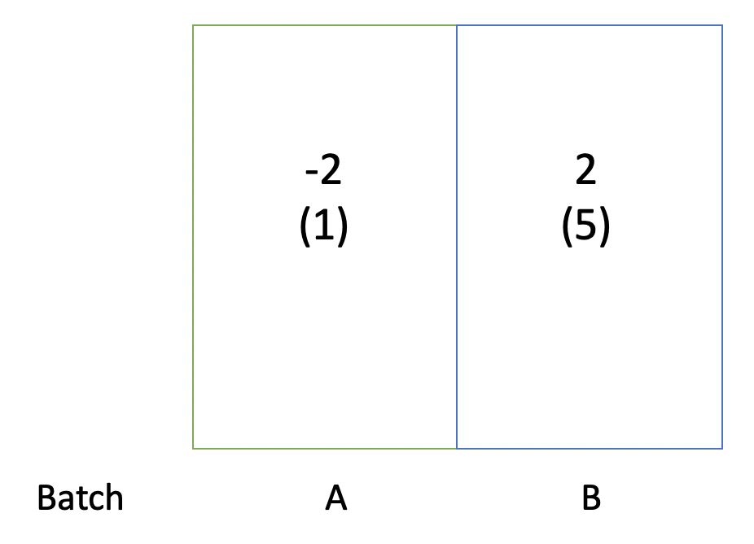

We saw in average gene counts that ComBat-Seq is not taking out all the batch effects (especially, mean batch effects in DE genes). So we design a simple experiment to test the behavior of quantile matching.

# How quantile matching works on Normal data

We start from Normal data. This small synthetic data set consists of 2 batches, with only batch but no biological effect. There is both a mean and a variance difference. Theoretically, ComBat should adjust both batches to **a mean of 0, variance of 3**.



```{r, results='hide', message=FALSE}
rm(list=ls())
sapply(c("sva", "ggplot2", "reshape2", "gridExtra", "BatchQC", "DESeq2", "edgeR", "SummarizedExperiment", "scales"), 
       require, character.only=TRUE)
source("ComBat_quantmatch.R")
source("helper.R")
set.seed(123)

####  Parameters  ####
mean_A <- -2; mean_B <- 2
var_A <- 1; var_B <- 5
n_A <- 40; n_B <- 40; n_all <- n_A + n_B
n_gene <- 10000

####  Simulate dataset  ####
expr_mat <- matrix(rep(NA, n_all*n_gene), nrow=n_gene, ncol=n_all)
batch <- c(rep("A", n_A), rep("B", n_B))
for(i in 1:nrow(expr_mat)){
  expr_mat[i, batch=="A"] <- rnorm(n_A, mean=mean_A, sd=sqrt(var_A))
  expr_mat[i, batch=="B"] <- rnorm(n_B, mean=mean_B, sd=sqrt(var_B))
}

####  Run ComBat, original and quantiile matching versions  ####
expr_combat <- sva::ComBat(expr_mat, batch=batch, mod=NULL)
expr_quant <- ComBat_quantmatch(expr_mat, batch=batch, mod=NULL)
```

## Behaviors of actual expression values

```{r, echo=FALSE}
####  Compare adjustments
datlst_ori <- list(A=expr_mat[, batch=="A"], B=expr_mat[, batch=="B"])
datlst_ori_mlt <- melt(datlst_ori); colnames(datlst_ori_mlt)[4] <- "Batch"
boxplt_ori <- ggplot(datlst_ori_mlt, aes(x=Batch, y=value)) +
  geom_boxplot() +
  labs(y="Expression", title="Unadjusted data")

datlst_combat <- list(A=expr_combat[, batch=="A"], B=expr_combat[, batch=="B"])
datlst_combat_mlt <- melt(datlst_combat); colnames(datlst_combat_mlt)[4] <- "Batch"
boxplt_combat <- ggplot(datlst_combat_mlt, aes(x=Batch, y=value)) +
  geom_boxplot() +
  labs(y="Expression", title="ComBat")

datlst_quant <- list(A=expr_quant[, batch=="A"], B=expr_quant[, batch=="B"])
datlst_quant_mlt <- melt(datlst_quant); colnames(datlst_quant_mlt)[4] <- "Batch"
boxplt_quant <- ggplot(datlst_quant_mlt, aes(x=Batch, y=value)) +
  geom_boxplot() +
  labs(y="Expression", title="Quantile matching")

grid.arrange(boxplt_ori, boxplt_combat, boxplt_quant, ncol=3)
```

<!--

## Explained variance analysis -->

```{r, eval=FALSE, echo=FALSE}
var_exp_ori <- batchqc_explained_variation(expr_mat, condition=NULL, batch=factor(batch))
var_exp_combat <- batchqc_explained_variation(expr_combat, condition=NULL, batch=factor(batch))
var_exp_quant <- batchqc_explained_variation(expr_quant, condition=NULL, batch=factor(batch))

varplt_ori <- ggplot(melt(var_exp_ori$explained_variation), aes(x=Var2, y=value)) +
  geom_boxplot() +
  labs(y="Explained Variance", title="Unadjusted") +
  theme(axis.title.x = element_blank())
varplt_combat <- ggplot(melt(var_exp_combat$explained_variation), aes(x=Var2, y=value)) +
  geom_boxplot() +
  labs(y="Explained Variance", title="ComBat") +
  theme(axis.title.x = element_blank())
varplt_quant <- ggplot(melt(var_exp_quant$explained_variation), aes(x=Var2, y=value)) +
  geom_boxplot() +
  labs(y="Explained Variance", title="Quantile matching") +
  theme(axis.title.x = element_blank())
grid.arrange(varplt_ori, varplt_combat, varplt_quant, ncol=3)
```


## ComBat step by step {.tabset}

### Input parameters & preparation 

```{r, message=FALSE, results='hide'}
####  Input paramters for ComBat
dat=expr_mat; mod=NULL; par.prior=TRUE; mean.only=FALSE; ref.batch=NULL; BPPARAM=bpparam("SerialParam")

####  ComBat 1st step - preparation
# make batch a factor and make a set of indicators for batch
if(mean.only==TRUE){
  message("Using the 'mean only' version of ComBat")
}
if(length(dim(batch))>1){
  stop("This version of ComBat only allows one batch variable")
}  ## to be updated soon!
batch <- as.factor(batch)
batchmod <- model.matrix(~-1+batch)  
if (!is.null(ref.batch)){
  ## check for reference batch, check value, and make appropriate changes
  if (!(ref.batch%in%levels(batch))) {
    stop("reference level ref.batch is not one of the levels of the batch variable")
  }
  cat("Using batch =",ref.batch, "as a reference batch (this batch won't change)\n")
  ref <- which(levels(as.factor(batch))==ref.batch) # find the reference
  batchmod[,ref] <- 1
} else {
  ref <- NULL
}
message("Found", nlevels(batch), "batches")

## A few other characteristics on the batches
n.batch <- nlevels(batch)
batches <- list()
for (i in 1:n.batch) {
  batches[[i]] <- which(batch == levels(batch)[i])
} # list of samples in each batch  
n.batches <- sapply(batches, length)
if(any(n.batches==1)){
  mean.only=TRUE
  message("Note: one batch has only one sample, setting mean.only=TRUE")
}
n.array <- sum(n.batches)
## combine batch variable and covariates
design <- cbind(batchmod,mod)

## check for intercept in covariates, and drop if present
check <- apply(design, 2, function(x) all(x == 1))
if(!is.null(ref)){
  check[ref] <- FALSE
} ## except don't throw away the reference batch indicator
design <- as.matrix(design[,!check])

## Number of covariates or covariate levels
message("Adjusting for", ncol(design)-ncol(batchmod), 'covariate(s) or covariate level(s)')

## Check if the design is confounded
if(qr(design)$rank < ncol(design)) {
  ## if(ncol(design)<=(n.batch)){stop("Batch variables are redundant! Remove one or more of the batch variables so they are no longer confounded")}
  if(ncol(design)==(n.batch+1)) {
    stop("The covariate is confounded with batch! Remove the covariate and rerun ComBat")
  }
  if(ncol(design)>(n.batch+1)) {
    if((qr(design[,-c(1:n.batch)])$rank<ncol(design[,-c(1:n.batch)]))){
      stop('The covariates are confounded! Please remove one or more of the covariates so the design is not confounded')
    } else {
      stop("At least one covariate is confounded with batch! Please remove confounded covariates and rerun ComBat")
    }
  }
}

## Check for missing values
NAs <- any(is.na(dat))
if(NAs){
  message(c('Found',sum(is.na(dat)),'Missing Data Values'), sep=' ')}
## print(dat[1:2,])
```

```{r}
dim(design)
head(design)
n.batch
n.batches
n.array
```

###  Standardization {.tabset}

```{r, message=FALSE, results='hide'}
##Standardize Data across genes
cat('Standardizing Data across genes\n')
if (!NAs){
  B.hat <- solve(crossprod(design), tcrossprod(t(design), as.matrix(dat)))
} else { 
  B.hat <- apply(dat, 1, Beta.NA, design) # FIXME
}

## change grand.mean for ref batch
if(!is.null(ref.batch)){
  grand.mean <- t(B.hat[ref, ])
} else {
  grand.mean <- crossprod(n.batches/n.array, B.hat[1:n.batch,])
}

## change var.pooled for ref batch
if (!NAs){
  if(!is.null(ref.batch)) {
    ref.dat <- dat[, batches[[ref]]]
    var.pooled <- ((ref.dat-t(design[batches[[ref]], ] %*% B.hat))^2) %*% rep(1/n.batches[ref],n.batches[ref]) # FIXME
  } else {
    var.pooled <- ((dat-t(design %*% B.hat))^2) %*% rep(1/n.array,n.array) # FIXME
  }
} else {
  if(!is.null(ref.batch)) {
    ref.dat <- dat[, batches[[ref]]]
    var.pooled <- rowVars(ref.dat-t(design[batches[[ref]], ]%*%B.hat), na.rm=TRUE)
  } else {
    var.pooled <- rowVars(dat-t(design %*% B.hat), na.rm=TRUE)
  }
}

stand.mean <- t(grand.mean) %*% t(rep(1,n.array)) # FIXME
if(!is.null(design)){
  tmp <- design
  tmp[,c(1:n.batch)] <- 0
  stand.mean <- stand.mean+t(tmp %*% B.hat) #FIXME
}  

s.data <- (dat-stand.mean)/(sqrt(var.pooled) %*% t(rep(1,n.array))) # FIXME
```

#### B.hat

*B.hat* is the matrix of coefficients ($\beta_j$ for biological condition and $\gamma_{gi}$ for mean batch effect) corresponding to *design*, solved by least square. Here we don't have a biological condition, so all rows represent $\gamma_{gi}$, one for each batch $i$.

```{r}
dim(B.hat)
B.hat[,1:10]
rowMeans(B.hat)
```

#### grand.mean

*grand.mean* represents $\alpha_g$ in the model, which is sample-size-weighted average of $\gamma_{gi}$ from all batches.

```{r}
dim(grand.mean)
grand.mean[1, 1:10]
mean(grand.mean)
```

#### var.pooled

*var.pooled* is the variance of genes across all batches pooled together, after adjusting for biological condition and mean batch effect. They correspond to $\delta_{gi}$ in the model (not strictly).

```{r}
dim(var.pooled)
var.pooled[1:10, 1]
mean(var.pooled)
```

#### stand.mean

*stand.mean* corresponds to $\alpha_g + X\beta_{j}$. It's a matrix the same size as the data matrix, with elements of mean for the z-score standardization. Here within both batches it is approximately 0 because we should shift both batches to the level of 0, and there is no biological condition for any sample.

```{r}
dim(stand.mean)
mean(stand.mean[, batch=="A"])
mean(stand.mean[, batch=="B"])
range(stand.mean)
```

#### s.data

Finally we have *s.data*, the standardized data. **NOTE: *s.data* contains shrinked mean batch effect**.

```{r}
c(batchA=mean(s.data[,batch=="A"]), batchB=mean(s.data[,batch=="B"]))
```

```{r}
tmp <- dat - stand.mean
c(batchA=mean(tmp[,batch=="A"]), batchB=mean(tmp[,batch=="B"]))
```


###  Estimate parameters {.tabset}

```{r, message=FALSE, results='hide'}
##Get regression batch effect parameters
message("Fitting L/S model and finding priors")
batch.design <- design[, 1:n.batch]
if (!NAs){
  gamma.hat <- solve(crossprod(batch.design), tcrossprod(t(batch.design),
                                                         as.matrix(s.data)))
} else{
  gamma.hat <- apply(s.data, 1, Beta.NA, batch.design) # FIXME
}
delta.hat <- NULL
for (i in batches){
  if(mean.only==TRUE) {
    delta.hat <- rbind(delta.hat,rep(1,nrow(s.data))) 
  } else {
    delta.hat <- rbind(delta.hat, rowVars(s.data[,i], na.rm=TRUE))
  }
}

##Find Priors
gamma.bar <- rowMeans(gamma.hat)
t2 <- rowVars(gamma.hat)
a.prior <- apply(delta.hat, 1, aprior) # FIXME 
b.prior <- apply(delta.hat, 1, bprior) # FIXME

## Find EB batch adjustments
gamma.star <- delta.star <- matrix(NA, nrow=n.batch, ncol=nrow(s.data))
if (par.prior) {
  message("Finding parametric adjustments")
  results <- bplapply(1:n.batch, function(i) {
    if (mean.only) {
      gamma.star <- postmean(gamma.hat[i,], gamma.bar[i], 1, 1, t2[i])
      delta.star <- rep(1, nrow(s.data))
    }else {
      temp <- it.sol(s.data[, batches[[i]]], gamma.hat[i, ],
                     delta.hat[i, ], gamma.bar[i], t2[i], a.prior[i],
                     b.prior[i])
      gamma.star <- temp[1, ]
      delta.star <- temp[2, ]
    }
    list(gamma.star=gamma.star, delta.star=delta.star)
  }, BPPARAM = BPPARAM)
  for (i in 1:n.batch) {
    gamma.star[i,] <- results[[i]]$gamma.star
    delta.star[i,] <- results[[i]]$delta.star
  }
}else {
  message("Finding nonparametric adjustments")
  results <- bplapply(1:n.batch, function(i) {
    if (mean.only) {
      delta.hat[i, ] = 1
    }
    temp <- int.eprior(as.matrix(s.data[, batches[[i]]]),
                       gamma.hat[i, ], delta.hat[i, ])
    list(gamma.star=temp[1,], delta.star=temp[2,])
  }, BPPARAM = BPPARAM)
  for (i in 1:n.batch) {
    gamma.star[i,] <- results[[i]]$gamma.star
    delta.star[i,] <- results[[i]]$delta.star
  }
}

if(!is.null(ref.batch)){
  gamma.star[ref,] <- 0  ## set reference batch mean equal to 0
  delta.star[ref,] <- 1  ## set reference batch variance equal to 1
}
```

#### gamma.hat

$\hat{\gamma}_{gi}$, mean batch effect parameter before EB shrinkage, estimated by a second least square on the standardized data *s.data*. The *gamma.hat* matrix is in the form of $\gamma_{ig}$, with rows corresponding to batches and columns corresponding to genes.

```{r}
dim(gamma.hat)
gamma.hat[,1:10]
```

**Note that the estimated $\gamma_{ig}$s do not equal to the theoretical values as we expect. In theory, we want to shift batch A up by 2 to 0, and shift batch B down by 2 to 0. But the actual estimated shifting distance is 1.185 for both batches. This is because *s.data* contains shrinked mean batch differences.**

```{r}
rowMeans(gamma.hat)
```

#### gamma.star

$\gamma^*_{gi}$, mean batch effect parameter after EB shrinkage. There shouldn't be many outliers in the data because we simulated the data from one Normal distribution. So the EB estimation shouldn't change the parameters a lot.

```{r}
dim(gamma.star)
gamma.star[,1:10]
rowMeans(gamma.star)
```

#### delta.hat & delta.star

Estimates of $\delta^2_{gi}$ before and after EB shrinkage. The standard deviation for the two batches are adjusted to roughly the same level, which is consistent with our observations from the boxplots.

```{r}
dim(delta.hat)
dim(delta.star)
sqrt(rowMeans(delta.hat))
sqrt(rowMeans(delta.star))
cat("Adjusted standard deviation\n")
sqrt(c(1, 5)) / sqrt(rowMeans(delta.star))
cat("Adjusted variance\n")
(sqrt(c(1, 5)) / sqrt(rowMeans(delta.star)))^2
```

###  Adjusting the data {.tabset}

#### By original methods

```{r}
bayesdata <- s.data
j <- 1
for (i in batches){
  bayesdata[,i] <- (bayesdata[,i]-t(batch.design[i,]%*%gamma.star))/(sqrt(delta.star[j,])%*%t(rep(1,n.batches[j]))) # FIXME
  j <- j+1
}

bayesdata <- (bayesdata*(sqrt(var.pooled)%*%t(rep(1,n.array))))+stand.mean # FIXME
```

*s.data* contains shrinked mean batch effect which corresponds to the estimates $\gamma^*_{gi}$, so the "reverse-standardization" can correct for the difference and bring the two batches to the same level.

```{r}
mean(bayesdata[,batch=="A"])
mean(bayesdata[,batch=="B"])
```

#### By quantile matching

However in quantile matching, the distribution we construct relies on the parameter estimates.

```{r}
quantdata <- gamma_mat <- delta_mat <- p_mat <- matrix(NA, nrow=nrow(dat), ncol=ncol(dat))
for(i in 1:n.batch){
  gamma_mat[, batches[[i]]] <- matrix(rep(gamma.star[i, ], n.batches[i]), nrow=nrow(dat))
  delta_mat[, batches[[i]]] <- matrix(rep(delta.star[i, ], n.batches[i]), nrow=nrow(dat))
}
sigma_mat <- var.pooled %*% t(rep(1,n.array))
delta_sigma_mat <- delta_mat * sigma_mat

for(a in 1:nrow(dat)){
  for(b in 1:ncol(dat)){
    p_mat[a, b] <- pnorm(dat[a, b], mean=stand.mean[a,b]+gamma_mat[a, b], sd=sqrt(delta_sigma_mat[a, b]))
    quantdata[a, b] <- qnorm(p_mat[a, b], mean=stand.mean[a,b], sd=sqrt(sigma_mat[a, b]))
  }
}
```

```{r}
cat("Adjusted data\n")
mean(quantdata[,batch=="A"])
mean(quantdata[,batch=="B"])

cat("Estimated original distribution (with batch)\n")
as.numeric(stand.mean[1, 1] + gamma_mat[1, 1])
delta_sigma_mat[1, 1]
cat("Estimated distribution we map to\n")
as.numeric(stand.mean[1, 1])
sigma_mat[1, 1]
```

We plot the observed quantiles. Batch A is simulated from $N(-2, 1)$ distribution. When we use a mean of -1.18 to fit it, most of the data will fall below the mean, resulting in percentiles smaller than 0.5. Similarly, we fit a distribution of mean 1.18 to data simulated from $N(2, 5)$, most of the data will fall above the mean, resulting in percentiles larger than 0.5.

```{r, echo=FALSE}
pmat_df <- list(A=p_mat[, batch=="A"], B=p_mat[, batch=="B"])
pmat_df_mlt <- melt(pmat_df)
pmat_plt <- ggplot(pmat_df_mlt, aes(x=L1, y=value)) +
  geom_boxplot() +
  geom_abline(slope=0, intercept=0.5, col="red") +
  labs(y="Percentiles", x="Batch", title="Observed percentiles")
pmat_plt
```

This means that the distributions we calculate are wrong. **We should enlarge *gamma.star* estimates using *var.pooled***. Corrected methods:

```{r}
quantdata2 <- p_mat2 <- matrix(NA, nrow=nrow(dat), ncol=ncol(dat))
for(a in 1:nrow(dat)){
  for(b in 1:ncol(dat)){
    p_mat2[a, b] <- pnorm(dat[a, b], mean=stand.mean[a,b] + gamma_mat[a, b]*sqrt(sigma_mat[a,b]), sd=sqrt(delta_sigma_mat[a, b]))
    quantdata2[a, b] <- qnorm(p_mat2[a, b], mean=stand.mean[a,b], sd=sqrt(sigma_mat[a, b]))
  }
}
```

```{r}
cat("Adjusted data (gamma.star enlarged)\n")
mean(quantdata2[,batch=="A"])
mean(quantdata2[,batch=="B"])
gamma_mat[1, 1]*sqrt(sigma_mat[1, 1])
gamma_mat[1, 41]*sqrt(sigma_mat[1, 41])
```

```{r}
datlst_quant2 <- list(A=quantdata2[, batch=="A"], B=quantdata2[, batch=="B"])
datlst_quant2_mlt <- melt(datlst_quant2); colnames(datlst_quant2_mlt)[4] <- "Batch"
boxplt_quant2 <- ggplot(datlst_quant2_mlt, aes(x=Batch, y=value)) +
  geom_boxplot() +
  labs(y="Expression", title="QM (corrected)")
grid.arrange(boxplt_ori, boxplt_combat, boxplt_quant, boxplt_quant2, ncol=4)
```


# How quantile matching works on counts (NB) data

We now start looking into count data. 

## Example 1 - library composition effect + no biological condition

We also start with a very simple example with 2 batches and no biological condition. We need to construct a **library composition batch effect** because that's what our model addresses.

```{r, results='hide', message=FALSE}
rm(list=ls())
source("../../ComBat_seq.R")
source("../../helper_seq.R")
set.seed(123)

####  Parameters  ####
mean_A <- 10; mean_B <- 20
disp_A <- 0.01; disp_B <- 0.05
n_A <- 40; n_B <- 40; n_all <- n_A + n_B
n_gene <- 10000

####  Simulate dataset  ####
cts_mat <- matrix(rep(NA, n_all*n_gene), nrow=n_gene, ncol=n_all)
batch <- c(rep("A", n_A), rep("B", n_B))
for(i in 1:nrow(cts_mat)){
  if(i <= n_gene / 2){
    cts_mat[i, batch=="A"] <- rnbinom(n_A, mu=mean_A, size=1/disp_A)
    cts_mat[i, batch=="B"] <- rnbinom(n_B, mu=mean_B, size=1/disp_B)
  }else{
    cts_mat[i, batch=="A"] <- rnbinom(n_A, mu=mean_B, size=1/disp_A)
    cts_mat[i, batch=="B"] <- rnbinom(n_B, mu=mean_A, size=1/disp_B)
  }
}

cat("Check library size\n")
colSums(cts_mat)
range(colSums(cts_mat))
```

```{r,results='hide', message=FALSE}
####  Run ComBat-Seq ####
cts_adj <- ComBat_seq(cts_mat, batch=batch, group=NULL, gene.subset.n=1000)
```

### Behaviors of actual counts

```{r, echo=FALSE, fig.height=4, fig.width=6}
gene_type_1 <- 1:(n_gene/2)
gene_type_2 <- ((n_gene/2)+1):n_gene

datlst_ori <- list(A=cts_mat[, batch=="A"], B=cts_mat[, batch=="B"])
datlst_ori_mlt <- melt(datlst_ori); colnames(datlst_ori_mlt)[4] <- "Batch"
boxplt_ori <- ggplot(datlst_ori_mlt, aes(x=Batch, y=value)) +
  geom_boxplot() +
  labs(y="Counts", title="Unadjusted - All")

datlst_ori1 <- list(A=cts_mat[gene_type_1, batch=="A"], B=cts_mat[gene_type_1, batch=="B"])
datlst_ori1_mlt <- melt(datlst_ori1); colnames(datlst_ori1_mlt)[4] <- "Batch"
boxplt_ori1 <- ggplot(datlst_ori1_mlt, aes(x=Batch, y=value)) +
  geom_boxplot() +
  labs(y="Counts", title="Unadjusted - Type 1")

datlst_ori2 <- list(A=cts_mat[gene_type_2, batch=="A"], B=cts_mat[gene_type_2, batch=="B"])
datlst_ori2_mlt <- melt(datlst_ori2); colnames(datlst_ori2_mlt)[4] <- "Batch"
boxplt_ori2 <- ggplot(datlst_ori2_mlt, aes(x=Batch, y=value)) +
  geom_boxplot() +
  labs(y="Counts", title="Unadjusted - Type 2")

datlst_adj <- list(A=cts_adj[, batch=="A"], B=cts_adj[, batch=="B"])
datlst_adj_mlt <- melt(datlst_adj); colnames(datlst_adj_mlt)[4] <- "Batch"
boxplt_adj <- ggplot(datlst_adj_mlt, aes(x=Batch, y=value)) +
  geom_boxplot() +
  labs(y="Counts", title="ComBat-Seq - All")

datlst_adj1 <- list(A=cts_adj[gene_type_1, batch=="A"], B=cts_adj[gene_type_1, batch=="B"])
datlst_adj1_mlt <- melt(datlst_adj1); colnames(datlst_adj1_mlt)[4] <- "Batch"
boxplt_adj1 <- ggplot(datlst_adj1_mlt, aes(x=Batch, y=value)) +
  geom_boxplot() +
  labs(y="Counts", title="ComBat-Seq - Type 1")

datlst_adj2 <- list(A=cts_adj[gene_type_2, batch=="A"], B=cts_adj[gene_type_2, batch=="B"])
datlst_adj2_mlt <- melt(datlst_adj2); colnames(datlst_adj2_mlt)[4] <- "Batch"
boxplt_adj2 <- ggplot(datlst_adj2_mlt, aes(x=Batch, y=value)) +
  geom_boxplot() +
  labs(y="Counts", title="ComBat-Seq - Type 2")

grid.arrange(boxplt_ori, boxplt_ori1, boxplt_ori2, boxplt_adj, boxplt_adj1, boxplt_adj2, nrow=2, ncol=3)
```

It appears that when there is only batch effect, ComBat-Seq is able to address the effect.

## Example 2 - library composition effect + biological condition

We now add in the biological condition. We still need to construct a **library composition batch effect**.

```{r, results='hide', message=FALSE}
rm(list=ls())
sapply(c("sva", "ggplot2", "reshape2", "gridExtra", "BatchQC", "DESeq2", "edgeR", "SummarizedExperiment", "scales"), 
       require, character.only=TRUE)
source("../../ComBat_seq.R")
source("../../helper_seq.R")
source("toy_helpers.R")
set.seed(11111)

####  Parameters  ####
setup_df <- data.frame(G_DE1=50, G_DE2=50, G_nonDE1=4950, G_nonDE2=4950, 
                       N_ctrl1=5, N_case1=5, N_ctrl2=5, N_case2=5,
                       mu1=10, mu2=15, bio_fold=2, size1=20, size2=40)
setup_df$N_1 <- setup_df$N_ctrl1 + setup_df$N_case1  
setup_df$N_2 <- setup_df$N_ctrl2 + setup_df$N_case2
setup_df$mu1_up <- setup_df$mu1 * setup_df$bio_fold 
setup_df$mu2_up <- setup_df$mu2 * setup_df$bio_fold
  
####  Simulate dataset  ####
sim_res <- simCounts(setup_df)
cts_mat <- sim_res$counts; batch <- sim_res$batch; group <- sim_res$group
```

```{r}  
cat("Check library size\n")
colSums(cts_mat)
range(colSums(cts_mat))
```

```{r,results='hide', message=FALSE}
####  Run ComBat-Seq ####
cts_adj <- ComBat_seq(cts_mat, batch=batch, group=group, gene.subset.n=1000)
```

### Behaviors of actual counts

```{r, echo=FALSE, fig.height=4, fig.width=6}
gene_type_1 <- 1:5000
gene_type_2 <- 5001:10000

boxplt4counts <- function(datlst, plt.title){
  datlst_mlt <- melt(datlst); colnames(datlst_mlt)[4] <- "Batch"
  boxplt <- ggplot(datlst_mlt, aes(x=Batch, y=value)) +
    geom_boxplot() +
    labs(y="Counts", title=plt.title)
  return(boxplt)
}

boxplt_ori <- boxplt4counts(list(A=cts_mat[, batch=="A"], B=cts_mat[, batch=="B"]), 
                            plt.title="Unadjusted - All") 
boxplt_ori1 <- boxplt4counts(list(A=cts_mat[gene_type_1, batch=="A"], B=cts_mat[gene_type_1, batch=="B"]), 
                             plt.title="Unadjusted - Type 1") 
boxplt_ori2 <- boxplt4counts(list(A=cts_mat[gene_type_2, batch=="A"], B=cts_mat[gene_type_2, batch=="B"]), 
                             plt.title="Unadjusted - Type 2") 
boxplt_adj <- boxplt4counts(list(A=cts_adj[, batch=="A"], B=cts_adj[, batch=="B"]), 
                            plt.title="ComBat-Seq - All") 
boxplt_adj1 <- boxplt4counts(list(A=cts_adj[gene_type_1, batch=="A"], B=cts_adj[gene_type_1, batch=="B"]), 
                             plt.title="ComBat-Seq - Type 1") 
boxplt_adj2 <- boxplt4counts(list(A=cts_adj[gene_type_2, batch=="A"], B=cts_adj[gene_type_2, batch=="B"]), 
                             plt.title="ComBat-Seq - Type 2") 

grid.arrange(boxplt_ori, boxplt_ori1, boxplt_ori2, boxplt_adj, boxplt_adj1, boxplt_adj2, nrow=2, ncol=3)
```

Splitting DE and non-DE genes:

```{r, echo=FALSE, fig.height=6, fig.width=3}
de1_ind <- 1:50
nonde1_ind <- 51:5000
de2_ind <- 5001:5050
nonde2_ind <- 5051:10000

boxplt_de1 <- boxplt4counts(list(A=cts_mat[de1_ind, batch=="A"], B=cts_mat[de1_ind, batch=="B"]), 
                            plt.title="Unjusted - DE - Type 1") 
boxplt_nonde1 <- boxplt4counts(list(A=cts_mat[nonde1_ind, batch=="A"], B=cts_mat[nonde1_ind, batch=="B"]), 
                               plt.title="Unjusted - nonDE - Type 1") 
boxplt_adj_de1 <- boxplt4counts(list(A=cts_adj[de1_ind, batch=="A"], B=cts_adj[de1_ind, batch=="B"]), 
                                plt.title="ComBat-Seq - DE - Type 1") 
boxplt_adj_nonde1 <- boxplt4counts(list(A=cts_adj[nonde1_ind, batch=="A"], B=cts_adj[nonde1_ind, batch=="B"]), 
                               plt.title="ComBat-Seq - nonDE - Type 1") 

boxplt_de2 <- boxplt4counts(list(A=cts_mat[de2_ind, batch=="A"], B=cts_mat[de2_ind, batch=="B"]), 
                            plt.title="Unjusted - DE - Type 2") 
boxplt_nonde2 <- boxplt4counts(list(A=cts_mat[nonde2_ind, batch=="A"], B=cts_mat[nonde2_ind, batch=="B"]), 
                               plt.title="Unjusted - nonDE - Type 2") 
boxplt_adj_de2 <- boxplt4counts(list(A=cts_adj[de2_ind, batch=="A"], B=cts_adj[de2_ind, batch=="B"]), 
                                plt.title="ComBat-Seq - DE - Type 2") 
boxplt_adj_nonde2 <- boxplt4counts(list(A=cts_adj[nonde2_ind, batch=="A"], B=cts_adj[nonde2_ind, batch=="B"]), 
                               plt.title="ComBat-Seq - nonDE - Type 2")

grid.arrange(boxplt_de1, boxplt_adj_de1, boxplt_nonde1, boxplt_adj_nonde1,
             boxplt_de2, boxplt_adj_de2, boxplt_nonde2, boxplt_adj_nonde2,
             nrow=4, ncol=2)
```

Explained Variation Analysis:

```{r}
var_exp_ori <- batchqc_explained_variation(log(cts_mat+0.25), condition=factor(group), batch=factor(batch))
var_exp_adj <- batchqc_explained_variation(log(cts_adj+0.25), condition=factor(group), batch=factor(batch))

eva_plt_ori <- ggplot(melt(var_exp_ori$explained_variation), aes(x=Var2, y=value)) +
  geom_boxplot() +
  labs(y="Explained Variance", title="Unadjusted") +
  theme(axis.title.x = element_blank())
eva_plt_adj <- ggplot(melt(var_exp_adj$explained_variation), aes(x=Var2, y=value)) +
  geom_boxplot() +
  labs(y="Explained Variance", title="ComBat-Seq") +
  theme(axis.title.x = element_blank())

grid.arrange(eva_plt_ori, eva_plt_adj, ncol=2)
```


### Does it matter? {.tabset}

#### DE

```{r, results='hide', message=FALSE}
## edgeR
edger_de_ori <- edgeR_DEpipe(cts_mat, batch=batch, group=group, include.batch=FALSE, alpha.unadj=1, alpha.fdr=1)
edger_de_1step <- edgeR_DEpipe(cts_mat, batch=batch, group=group, include.batch=TRUE, alpha.unadj=1, alpha.fdr=1)
edger_de_combatseq <- edgeR_DEpipe(cts_adj, batch=batch, group=group, include.batch=FALSE, alpha.unadj=1, alpha.fdr=1)

## DESeq2
deseq2_de_ori <- DESeq2_DEpipe(cts_mat, batch=batch, group=group, include.batch=FALSE, alpha.unadj=1, alpha.fdr=1)
deseq2_de_1step <- DESeq2_DEpipe(cts_mat, batch=batch, group=group, include.batch=TRUE, alpha.unadj=1, alpha.fdr=1)
deseq2_de_combatseq <- DESeq2_DEpipe(cts_adj, batch=batch, group=group, include.batch=FALSE, alpha.unadj=1, alpha.fdr=1)
```

```{r}
edger_de_ori_pred <- rownames(edger_de_ori$de_res)[edger_de_ori$de_res$FDR < 0.05]
edger_de_1step_pred <- rownames(edger_de_1step$de_res)[edger_de_1step$de_res$FDR < 0.05]
edger_de_combatseq_pred <- rownames(edger_de_combatseq$de_res)[edger_de_combatseq$de_res$FDR < 0.05]

de_ground_truth_vec <- paste0("gene", c(de1_ind, de2_ind))
edger_perfs <- data.frame(
  raw.counts=perfStats(called_vec=edger_de_ori_pred, ground_truth_vec=de_ground_truth_vec, N_genes=nrow(cts_mat)),
  one.step=perfStats(called_vec=edger_de_1step_pred, ground_truth_vec=de_ground_truth_vec, N_genes=nrow(cts_mat)),
  combat.seq=perfStats(called_vec=edger_de_combatseq_pred, ground_truth_vec=de_ground_truth_vec, N_genes=nrow(cts_mat)))
print(edger_perfs)
```

```{r}
deseq2_de_ori_pred <- rownames(deseq2_de_ori$de_res)[deseq2_de_ori$de_res$padj < 0.05]
deseq2_de_1step_pred <- rownames(deseq2_de_1step$de_res)[deseq2_de_1step$de_res$padj < 0.05]
deseq2_de_combatseq_pred <- rownames(deseq2_de_combatseq$de_res)[deseq2_de_combatseq$de_res$padj < 0.05]

deseq2_perfs <- data.frame(
  raw.counts=perfStats(called_vec=deseq2_de_ori_pred, ground_truth_vec=de_ground_truth_vec, N_genes=nrow(cts_mat)),
  one.step=perfStats(called_vec=deseq2_de_1step_pred, ground_truth_vec=de_ground_truth_vec, N_genes=nrow(cts_mat)),
  combat.seq=perfStats(called_vec=deseq2_de_combatseq_pred, ground_truth_vec=de_ground_truth_vec, N_genes=nrow(cts_mat)))
print(deseq2_perfs)
```

#### PCA

```{r}
col_data <- data.frame(Batch=factor(batch), Group=factor(group)); rownames(col_data) <- colnames(cts_mat)
seobj <- SummarizedExperiment(assays=cts_mat, colData=col_data)
pca_obj <- plotPCA(DESeqTransform(seobj), intgroup=c("Batch", "Group"))
plt <- ggplot(pca_obj$data, aes(x=PC1, y=PC2, color=Batch, shape=Group)) + 
  geom_point() + 
  labs(x=sprintf("PC1: %s Variance", percent(pca_obj$plot_env$percentVar[1])),
       y=sprintf("PC2: %s Variance", percent(pca_obj$plot_env$percentVar[2])),
       title="Color by Batch - Unadjusted") +
  theme(legend.position="bottom")
seobj_adj <- SummarizedExperiment(assays=cts_adj, colData=col_data)
pca_obj_adj <- plotPCA(DESeqTransform(seobj_adj), intgroup=c("Batch", "Group"))
plt_adj <- ggplot(pca_obj_adj$data, aes(x=PC1, y=PC2, color=Batch, shape=Group)) + 
  geom_point() + 
  labs(x=sprintf("PC1: %s Variance", percent(pca_obj_adj$plot_env$percentVar[1])),
       y=sprintf("PC2: %s Variance", percent(pca_obj_adj$plot_env$percentVar[2])),
       title="Color by Batch - ComBat-Seq") +
  theme(legend.position="bottom")
grid.arrange(plt, plt_adj, ncol=2)
```

The "flipping pattern" still exists. It may relate to **the number of samples**.

## ComBat-Seq step by step {.tabset}

### Input parameters & preparation 

```{r}
########  Input parameters  ########  
counts=cts_mat; covar_mod=NULL; full_mod=TRUE; gene.subset.n=1000; Cpp=FALSE

########  Preparation  ########  
dge_obj <- DGEList(counts=counts)

## Prepare characteristics on batches
batch <- as.factor(batch)
n_batch <- nlevels(batch)  # number of batches
batches_ind <- lapply(1:n_batch, function(i){which(batch==levels(batch)[i])}) # list of samples in each batch  
n_batches <- sapply(batches_ind, length)
#if(any(n_batches==1)){mean_only=TRUE; cat("Note: one batch has only one sample, setting mean.only=TRUE\n")}
n_sample <- sum(n_batches)
cat("Found",n_batch,'batches\n')

## Make design matrix 
# batch
batchmod <- model.matrix(~-1+batch)  # colnames: levels(batch)
# covariate
group <- as.factor(group)
if(full_mod & nlevels(group)>1){
  cat("Using full model in ComBat-seq.\n")
  mod <- model.matrix(~group)
}else{
  cat("Using null model in ComBat-seq.\n")
  mod <- model.matrix(~1, data=as.data.frame(t(counts)))
}
# drop intercept in covariate model
if(!is.null(covar_mod)){covar_mod <- covar_mod[, !apply(covar_mod, 2, function(x){all(x==1)})]}
# bind with biological condition of interest
mod <- cbind(mod, covar_mod)
# combine
design <- cbind(batchmod, mod)

## Check for intercept in covariates, and drop if present
check <- apply(design, 2, function(x) all(x == 1))
#if(!is.null(ref)){check[ref]=FALSE} ## except don't throw away the reference batch indicator
design <- as.matrix(design[,!check])
cat("Adjusting for",ncol(design)-ncol(batchmod),'covariate(s) or covariate level(s)\n')

## Check if the design is confounded
if(qr(design)$rank<ncol(design)){
  #if(ncol(design)<=(n_batch)){stop("Batch variables are redundant! Remove one or more of the batch variables so they are no longer confounded")}
  if(ncol(design)==(n_batch+1)){stop("The covariate is confounded with batch! Remove the covariate and rerun ComBat")}
  if(ncol(design)>(n_batch+1)){
    if((qr(design[,-c(1:n_batch)])$rank<ncol(design[,-c(1:n_batch)]))){stop('The covariates are confounded! Please remove one or more of the covariates so the design is not confounded')
    }else{stop("At least one covariate is confounded with batch! Please remove confounded covariates and rerun ComBat")}}
}

## Check for missing values in count matrix
NAs = any(is.na(counts))
if(NAs){cat(c('Found',sum(is.na(counts)),'Missing Data Values\n'),sep=' ')}
```

```{r}
dim(design)
design
n_batch
n_batches
n_sample
```

###  Estimate gene-wise dispersions within each batch 

```{r}
## Estimate common dispersion within each batch as an initial value
disp_common <- sapply(1:n_batch, function(i){
  if(n_batches[i]==1){
    stop("ComBat-seq doesn't support 1 sample per batch yet!")
  }else if((n_batches[i] <= ncol(design)-ncol(batchmod)+1) | qr(mod[batches_ind[[i]], ])$rank < ncol(mod)){ 
    # not enough residual degree of freedom
    return(estimateGLMCommonDisp(counts[, batches_ind[[i]]], design=NULL, subset=nrow(counts)))
    #as.matrix(design[batches_ind[[i]], (n_batch+1):ncol(design)]),
  }else{
    return(estimateGLMCommonDisp(counts[, batches_ind[[i]]], design=mod[batches_ind[[i]], ], subset=nrow(counts)))
  }
})

## Estimate gene-wise dispersion within each batch 
genewise_disp_lst <- lapply(1:n_batch, function(j){
  if(n_batches[j]==1){
    stop("ComBat-seq doesn't support 1 sample per batch yet!")
  }else if((n_batches[j] <= ncol(design)-ncol(batchmod)+1) | qr(mod[batches_ind[[j]], ])$rank < ncol(mod)){
    # not enough residual degrees of freedom - use the common dispersion
    # return(estimateGLMTagwiseDisp(counts[, batches_ind[[j]]], design=NULL, 
    #                               dispersion=disp_common[j], prior.df=0))
    return(rep(disp_common[j], nrow(counts)))
    #as.matrix(design[batches_ind[[j]], (n_batch+1):ncol(design)]),
  }else{
    return(estimateGLMTagwiseDisp(counts[, batches_ind[[j]]], design=mod[batches_ind[[j]], ], 
                                  dispersion=disp_common[j], prior.df=0))
  }
})
names(genewise_disp_lst) <- paste0('batch', levels(batch))

## construct dispersion matrix
phi_matrix <- matrix(NA, nrow=nrow(counts), ncol=ncol(counts))
for(k in 1:n_batch){
  phi_matrix[, batches_ind[[k]]] <- vec2mat(genewise_disp_lst[[k]], n_batches[k]) #matrix(rep(genewise_disp_lst[[k]], n_batches[k]), ncol=n_batches[k])
}#round(apply(phi_matrix,2,mean),2)
```

```{r}
disp_common
sapply(genewise_disp_lst, length)
sapply(genewise_disp_lst, mean)
round(apply(phi_matrix,2,mean),2)
```

###  Estimate parameters from NB GLM  

```{r}
glm_f <- glmFit(dge_obj, design=design, dispersion=phi_matrix, prior.count=1e-4) #no intercept - nonEstimable; compute offset (library sizes) within function
alpha_g <- glm_f$coefficients[, 1:n_batch] %*% as.matrix(n_batches/n_sample) #compute intercept as batch-size-weighted average from batches
new_offset <- t(vec2mat(getOffset(dge_obj), nrow(counts))) +   # original offset - sample (library) size
  vec2mat(alpha_g, ncol(counts))  # new offset - gene background expression
# getOffset(dge_obj) is the same as log(dge_obj$samples$lib.size)
glm_f2 <- glmFit.default(dge_obj$counts, design=design, dispersion=phi_matrix, offset=new_offset, prior.count=1e-4) 

#beta_hat <- glm_f2$coefficients[, (n_batch+1):ncol(design)]
gamma_hat <- glm_f2$coefficients[, 1:n_batch]
mu_hat <- glm_f2$fitted.values
phi_hat <- do.call(cbind, genewise_disp_lst)
#if(!identical(colnames(gamma_hat), colnames(phi_hat))){stop("gamma and phi don't match!")}
#tmp = mu_hat - exp(glm_f2$coefficients %*% t(design) + new_offset); tmp[1:6,1:6]; mean(tmp)
```

```{r}
## coefficients (model 1)
head(glm_f$coefficients)
tail(glm_f$coefficients)

## sanity check: estimated batch mean in gene type 1 
exp(colMeans(glm_f$coefficients[51:5000, 1:n_batch])) * mean(colSums(counts))

## average background count alpha
mean(alpha_g)
exp(mean(alpha_g))*mean(colSums(counts))

## coefficients (model 2)
head(glm_f2$coefficients)
tail(glm_f2$coefficients)
```

###  Posterior estimates via Monte Carlo Integration

```{r}
if(Cpp){mcint_fun <- monte_carlo_int_NB_cpp}else{mcint_fun <- monte_carlo_int_NB}
monte_carlo_res <- lapply(1:n_batch, function(ii){
  if(ii==1){
    mcres <- mcint_fun(dat=counts[, batches_ind[[ii]]], mu=mu_hat[, batches_ind[[ii]]], 
                       gamma=gamma_hat[, ii], phi=phi_hat[, ii], gene.subset.n=gene.subset.n)
  }else{
    invisible(capture.output(mcres <- mcint_fun(dat=counts[, batches_ind[[ii]]], mu=mu_hat[, batches_ind[[ii]]], 
                                                gamma=gamma_hat[, ii], phi=phi_hat[, ii], gene.subset.n=gene.subset.n)))
  }
  return(mcres)
  #ii=2;dat=counts[, batches_ind[[ii]]]; mu=mu_hat[, batches_ind[[ii]]]; gamma=gamma_hat[, ii]; phi=phi_hat[, ii]
})
names(monte_carlo_res) <- paste0('batch', levels(batch))

gamma_star_mat <- lapply(monte_carlo_res, function(res){res$gamma_star})
gamma_star_mat <- do.call(cbind, gamma_star_mat)
phi_star_mat <- lapply(monte_carlo_res, function(res){res$phi_star})
phi_star_mat <- do.call(cbind, phi_star_mat)
```

```{r}
## prior average exp(gamma) in gene type 1
## NOTE: adjusted mean = original mean / exp(gamma)
exp(colMeans(gamma_hat[51:5000,]))
c(15,10)/exp(colMeans(gamma_hat[51:5000,]))
c(30,20)/exp(colMeans(gamma_hat[51:5000,]))

## posterior average exp(gamma) in gene type 1
exp(colMeans(gamma_star_mat[51:5000,]))
exp(colMeans(gamma_star_mat[5051:10000,]))

## prior average dispersion
colMeans(phi_hat)

## posterior average dispersion
colMeans(phi_star_mat)
```

###  Batch-free distributions

```{r}
########  Obtain adjusted batch-free distribution  ########
mu_star <- matrix(NA, nrow=nrow(counts), ncol=ncol(counts))
for(jj in 1:n_batch){
  mu_star[, batches_ind[[jj]]] <- exp(log(mu_hat[, batches_ind[[jj]]])-
                                        vec2mat(gamma_star_mat[, jj], n_batches[jj])#-
                                      #t(vec2mat(getOffset(dge_obj)[batches_ind[[jj]]], nrow(counts)))
  )
}
phi_star <- rowMeans(phi_star_mat)
```

```{r}
## batch-free mean mu
# type 1
mean(mu_star[51:5000,batch=="A"])
mean(mu_star[51:5000,batch=="B"])
# type 2
mean(mu_star[5051:10000,batch=="A"])
mean(mu_star[5051:10000,batch=="B"])

## batch-free dispersion phi
print(mean(phi_star))
```

###  Adjusting the data with quantile matching

```{r}
match_quantiles_testpars <- function(counts_sub, old_mu, old_phi, new_mu, new_phi){
  new_counts_sub <- pmat <- matrix(NA, nrow=nrow(counts_sub), ncol=ncol(counts_sub))
  for(a in 1:nrow(counts_sub)){
    for(b in 1:ncol(counts_sub)){
      if(counts_sub[a, b]==0){
        new_counts_sub[a,b] <- 0
        #pmat[a,b] <- 0.5
      }else{
        tmp_p <- pnbinom(counts_sub[a, b]-1, mu=old_mu[a, b], size=1/old_phi[a])
        if(abs(tmp_p-1)<1e-4){
          new_counts_sub[a,b] <- counts_sub[a, b]  
          # for outlier count, if p==1, will return Inf values -> use original count instead
        }else{
          new_counts_sub[a,b] <- 1+qnbinom(tmp_p, mu=new_mu[a, b], size=1/new_phi[a])
        }
        pmat[a,b] <- tmp_p
      }
    }
  }
  return(list(cts=new_counts_sub, pmat=pmat))
}

adjust_counts <- p_matrix <- matrix(NA, nrow=nrow(counts), ncol=ncol(counts))
for(kk in 1:n_batch){
  counts_sub <- counts[, batches_ind[[kk]]]
  old_mu <- mu_hat[, batches_ind[[kk]]]
  old_phi <- phi_hat[, kk]
  new_mu <- mu_star[, batches_ind[[kk]]]
  new_phi <- phi_star
  adjust_res <- match_quantiles_testpars(counts_sub=counts_sub, 
                                         old_mu=old_mu, old_phi=old_phi, 
                                         new_mu=new_mu, new_phi=new_phi)
  adjust_counts[, batches_ind[[kk]]] <- adjust_res$cts
  p_matrix[, batches_ind[[kk]]] <- adjust_res$pmat
}
dimnames(adjust_counts) <- dimnames(counts)
dimnames(p_matrix) <- dimnames(counts)
```

```{r}
col_data <- data.frame(Batch=factor(batch), Group=factor(group)); rownames(col_data) <- colnames(counts)
seobj <- SummarizedExperiment(assays=counts, colData=col_data)
pca_obj <- plotPCA(DESeqTransform(seobj), intgroup=c("Batch", "Group"))
plt <- ggplot(pca_obj$data, aes(x=PC1, y=PC2, color=Batch, shape=Group)) + 
  geom_point() + 
  labs(x=sprintf("PC1: %s Variance", percent(pca_obj$plot_env$percentVar[1])),
       y=sprintf("PC2: %s Variance", percent(pca_obj$plot_env$percentVar[2])),
       title="Color by Batch - Unadjusted") +
  theme(legend.position="bottom")
seobj_adj <- SummarizedExperiment(assays=adjust_counts, colData=col_data)
pca_obj_adj <- plotPCA(DESeqTransform(seobj_adj), intgroup=c("Batch", "Group"))
plt_adj <- ggplot(pca_obj_adj$data, aes(x=PC1, y=PC2, color=Batch, shape=Group)) + 
  geom_point() + 
  labs(x=sprintf("PC1: %s Variance", percent(pca_obj_adj$plot_env$percentVar[1])),
       y=sprintf("PC2: %s Variance", percent(pca_obj_adj$plot_env$percentVar[2])),
       title="Color by Batch - ComBat-Seq") +
  theme(legend.position="bottom")
grid.arrange(plt, plt_adj, ncol=2)
```

```{r, fig.height=4, fig.width=4}
de1_ind <- 1:50
nonde1_ind <- 51:5000
de2_ind <- 5001:5050
nonde2_ind <- 5051:10000

plt4pmat <- function(datlst, plt.title){
  datlst_mlt <- melt(datlst); colnames(datlst_mlt)[4] <- "Batch"
  plt <- ggplot(datlst_mlt, aes(x=Batch, y=value)) +
    geom_violin() +
    geom_boxplot() +
    labs(y="Percentiles", title=plt.title)
  return(plt)
}

plt_pmat_de1 <- plt4pmat(list(A=p_matrix[de1_ind, batch=="A"], B=p_matrix[de1_ind, batch=="B"]), 
                               plt.title="Percentiles - Type 1 DE") 
plt_pmat_nonde1 <- plt4pmat(list(A=p_matrix[nonde1_ind, batch=="A"], B=p_matrix[nonde1_ind, batch=="B"]), 
                                  plt.title="Percentiles - Type 1 non-DE")
plt_pmat_de2 <- plt4pmat(list(A=p_matrix[de2_ind, batch=="A"], B=p_matrix[de2_ind, batch=="B"]), 
                               plt.title="Percentiles - Type 2 DE") 
plt_pmat_nonde2 <- plt4pmat(list(A=p_matrix[nonde2_ind, batch=="A"], B=p_matrix[nonde2_ind, batch=="B"]), 
                                  plt.title="Percentiles - Type 2 non-DE")
grid.arrange(plt_pmat_de1, plt_pmat_de2, plt_pmat_nonde1, plt_pmat_nonde2, ncol=2, nrow=2)
```

```{r}
cat("Type 1 non-DE average percentiles (A: 15, B: 10): \n")
sapply(list(A=p_matrix[nonde1_ind, batch=="A"], B=p_matrix[nonde1_ind, batch=="B"]), median, na.rm=T)
cat("Type 2 non-DE average percentiles (A: 10, B: 15): \n")
sapply(list(A=p_matrix[nonde2_ind, batch=="A"], B=p_matrix[nonde2_ind, batch=="B"]), median, na.rm=T)
```

## The question becomes...

We have two distributions $NB(\mu, \phi)$ for the two simulated batches: Batch 1: $NB(10, 0.05)$, Batch 2: $NB(15, 0.05)$ and we want to map them both to the estimated batch-free distribution: $NB(12.23, 0.05)$. What do they look like? So I would generate random samples from the two distributions, and see how they fall on the batch-free distribution.

```{r}
batch1_data <- rnbinom(n=100000, mu=10, size=20)
batch2_data <- rnbinom(n=100000, mu=15, size=20)
batch_free_data <- rnbinom(n=100000, mu=12.23, size=20)
batch_df <- data.frame(batch.free=batch_free_data, batch1=batch1_data, batch2=batch2_data)
ggplot(batch_df) + 
  geom_histogram(aes(x=batch1, y=..density..), binwidth=1, fill='blue', alpha=0.2) +
  geom_histogram(aes(x=batch2, y=..density..), binwidth=1, fill='orange', alpha=0.2) +
  geom_density(aes(x=batch.free), color="black") +
  theme(axis.title.x = element_blank())
```

```{r}
match_quantiles_testidea <- function(datvec, old_mu, old_phi, new_mu, new_phi){
  newdat_vec <- pvec <- rep(NA, length(datvec))
  for(i in 1:length(datvec)){
    if(datvec[i]==0){
      newdat_vec[i] <- 0
    }else{
      tmp_p <- pnbinom(datvec[i]-1, mu=old_mu, size=1/old_phi)
      if(abs(tmp_p-1)<1e-4){
        newdat_vec[i] <- datvec[i]
      }else{
        newdat_vec[i] <- 1+qnbinom(tmp_p, mu=new_mu, size=1/new_phi)
      }
      pvec[i] <- tmp_p
    }
  }
  return(list(newdat_vec=newdat_vec, pvec=pvec))
}

batch1_QM <- match_quantiles_testidea(batch1_data, old_mu=10, old_phi=0.05, new_mu=12.23, new_phi=0.05)
batch2_QM <- match_quantiles_testidea(batch2_data, old_mu=15, old_phi=0.05, new_mu=12.23, new_phi=0.05)
batch_QM <- data.frame(batch.free=batch_df$batch.free, batch1=batch1_QM$newdat_vec, batch2=batch2_QM$newdat_vec)
ggplot(batch_QM) + 
  geom_histogram(aes(x=batch1, y=..density..), binwidth=1, fill='blue', alpha=0.2) +
  geom_histogram(aes(x=batch2, y=..density..), binwidth=1, fill='orange', alpha=0.2) +
  geom_density(aes(x=batch.free), color="black") +
  theme(axis.title.x = element_blank())
```

```{r}
pnbinom(10, mu=10, size=20)
pnbinom(12.23, mu=12.23, size=20)
pnbinom(15, mu=15, size=20)

#median(batch1_QM$pvec, na.rm=T)
#median(batch2_QM$pvec, na.rm=T)

sum(batch1_data > 10) / length(batch1_data)
sum(batch2_data > 15) / length(batch2_data)

sum(batch1_QM$newdat_vec > 12.23) / length(batch1_QM$newdat_vec)
sum(batch2_QM$newdat_vec > 12.23) / length(batch1_QM$newdat_vec)

mean(batch1_QM$newdat_vec)
mean(batch2_QM$newdat_vec)
```

